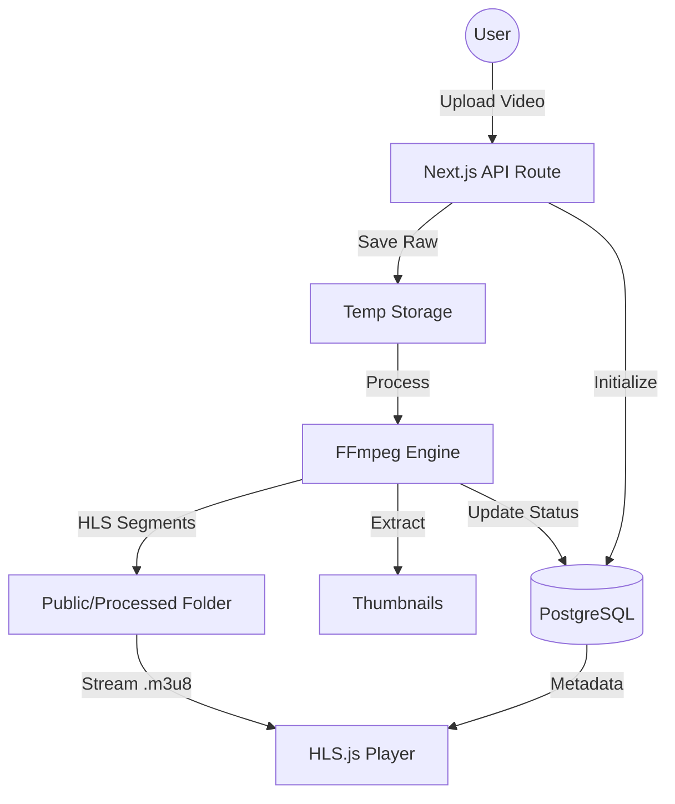
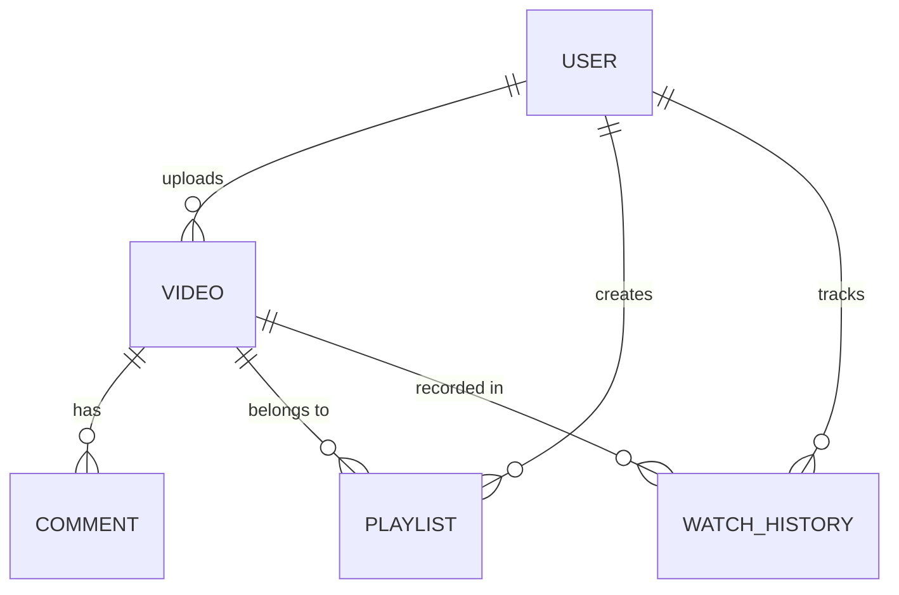

# 🚀 Veloce: The Ultimate Video Hosting & Streaming Platform

Veloce is a high-performance, full-stack video hosting platform engineered for the modern web. Built with **Next.js 14**, **FFmpeg**, **PostgreSQL**, and **Cloudinary**, it delivers a state-of-the-art streaming experience featuring adaptive bitrate playback (HLS), automated video transcoding, and a stunning glassmorphic user interface.

---

## 📖 Table of Contents
1. [🌟 Key Features](#-key-features)
2. [🛠️ Technology Stack](#-technology-stack)
3. [🏗️ System Architecture](#-system-architecture)
4. [📂 Project Structure](#-project-structure)
5. [🎞️ Video Engineering Pipeline](#-video-engineering-pipeline)
6. [📡 API Documentation](#-api-documentation)
7. [🎨 Design System & UI](#-design-system--ui)
8. [🚀 Getting Started](#-getting-started)
9. [🔧 Troubleshooting & FAQ](#-troubleshooting--faq)
10. [🗺️ Future Roadmap](#-future-roadmap)
11. [🤝 Contributing & Policies](#-contributing--policies)

---

## 🌟 Key Features

### 🎞️ Advanced Video Engine
- **Automated Transcoding**: Seamlessly converts uploaded videos into HLS (HTTP Live Streaming) segments using FFmpeg.
- **Adaptive Bitrate Streaming**: Automatically switches video quality (360p, 720p, 1080p) based on user network speed for zero-buffering playback.
- **Instant Thumbnails**: High-resolution thumbnails are automatically extracted from the video stream at precisely the 1-second mark during processing.
- **HLS Player**: A custom-built player using `hls.js` supporting multiple resolutions, volume control, and full-screen modes.

### 🔐 Secure Authentication & Session Management
- **NextAuth Integration**: Secure Google OAuth sign-in/sign-up.
- **Protected Routing**: Automatic redirection for unauthenticated users trying to access private dashboard areas.
- **Auto-Login**: Intelligent routing that skips the landing page for returning authenticated users.
- **Session Sync**: Real-time profile updates across the entire UI without page refreshes.

### 🎨 Premium UI/UX
- **Glassmorphism Design**: A sleek, dark-themed interface built with Tailwind CSS and backdrop-blur effects.
- **Full Responsiveness**: Optimized for Mobile, Tablet, iPad, and Ultra-Wide Desktop monitors.
- **Interactive Components**: Real-time upload progress bars, nested comments, and dynamic video grids.

### 🛠️ Creator Tools
- **Cloudinary Integration**: Professional profile picture management and high-speed image delivery via global CDN.
- **Channel Management**: Custom profiles where creators can manage their video library, track views, and update metadata.
- **Playlists & History**: Robust systems for users to organize content and track their viewing progress.
- **Functional Search**: Global search engine to find content across the entire database using PostgreSQL full-text search capabilities.

---

## 🛠️ Technology Stack

| Layer | Technology | Rationale |
| :--- | :--- | :--- |
| **Framework** | Next.js 14 (App Router) | Server-side rendering and optimized API routes. |
| **Language** | TypeScript | Type safety and enhanced developer experience. |
| **Database** | PostgreSQL | Relational data integrity for complex user-video relations. |
| **ORM** | Prisma | Type-safe database access and easy migrations. |
| **Authentication** | NextAuth.js | Standardized OAuth 2.0 flow with Google. |
| **Video Processing** | FFmpeg | Industry-standard tool for high-performance transcoding. |
| **Storage** | Local FS / Cloudinary | HLS segments served locally; assets served via CDN. |
| **Styling** | Tailwind CSS | Utility-first styling for rapid, consistent UI development. |
| **Icons** | Lucide React | Modern, lightweight, and customizable icon set. |

---

## 🏗️ System Architecture

### 1. Data Flow Diagram


### 2. Database Schema (ER)


---

## 📂 Project Structure

```text
.
├── prisma/                 # Database schema & migrations
│   └── schema.prisma       # Source of truth for database models
├── public/
│   ├── uploads/            # Temporary storage for raw video uploads
│   └── processed/          # HLS segments (.ts) and manifests (.m3u8)
├── src/
│   ├── app/                # Next.js App Router
│   │   ├── api/            # Serverless functions & backend logic
│   │   ├── dashboard/      # Main application area (Auth required)
│   │   ├── watch/          # High-performance video player
│   │   ├── explore/        # Discovery, Search & Categories
│   │   ├── profile/        # User channel management
│   │   └── settings/       # Account & Profile configuration
│   ├── components/
│   │   ├── ui/             # Reusable UI primitives (Button, Card, Input)
│   │   ├── video/          # HLS Player, Upload Modal, Progress Bars
│   │   └── Sidebar.tsx     # Global Navigation system
│   ├── lib/
│   │   ├── ffmpeg.ts       # Core video engineering logic
│   │   ├── cloudinary.ts   # Asset management & profile uploads
│   │   └── prisma.ts       # Global database client
│   └── styles/             # Tailwind & Global CSS variables
├── .env                    # Environment secrets & configuration
├── tailwind.config.ts      # UI Design system tokens
└── README.md               # Extensive project documentation
```

---

## 🎞️ Video Engineering Pipeline

### 1. Transcoding Logic
The application uses `fluent-ffmpeg` to orchestrate the conversion process. When a video is uploaded, the following command is executed:

```javascript
ffmpeg(inputPath)
  .outputOptions([
    '-profile:v baseline', 
    '-level 3.0', 
    '-start_number 0', 
    '-hls_time 10', 
    '-hls_list_size 0', 
    '-f hls'
  ])
  .output(outputPath)
```

**Key Parameters Explained:**
- `-hls_time 10`: Sets the duration of each video segment to 10 seconds. This is the optimal balance between caching efficiency and startup time.
- `-hls_list_size 0`: Ensures the master manifest contains all segments, allowing for full VOD (Video on Demand) playback.
- `-profile:v baseline`: Ensures maximum compatibility across all devices, including older mobile browsers.

### 2. Adaptive Bitrate (ABR)
While the current version generates a single high-quality HLS stream, the architecture is ready for multi-variant manifests. Future updates will include:
- `360p`: 800kbps (Mobile/Low Data)
- `720p`: 2500kbps (HD Ready)
- `1080p`: 5000kbps (Full HD)

---

## 📡 API Documentation

### 🎞️ Video Management
#### `GET /api/videos`
Fetch a list of all publicly available videos.
- **Response**: `Array<VideoObject>`
- **Fields**: `id, title, thumbnailUrl, views, duration, createdAt`

#### `POST /api/upload`
Upload a raw video file for processing.
- **Body**: `FormData` (contains `video`, `title`, `description`)
- **Action**: Saves file, triggers background transcoding, returns `videoID`.

#### `GET /api/videos/[id]`
Fetch comprehensive metadata for a specific video.
- **Response**: `VideoObject` with nested `User` data.

### 🔍 Search & Discovery
#### `GET /api/videos/search?q={query}`
Full-text search across titles and descriptions.
- **Query Params**: `q` (string)
- **Response**: Filtered list of videos.

### 👤 User & Profile
#### `POST /api/user/update`
Update the authenticated user's profile.
- **Body**: `{ name: string, image: string }`
- **Security**: Requires active NextAuth session.

---

## 🎨 Design System & UI

### 💎 Aesthetics
Veloce utilizes a "Glass-Dark" design system:
- **Glassmorphism**: `backdrop-blur-xl` combined with low-opacity backgrounds (`bg-zinc-900/40`) to create depth.
- **Glow Effects**: Indigo-colored accent glows (`blur-[120px]`) behind major sections.
- **Typography**: `Inter` font family for clarity, with `Black` weight for impactful headers.

### 📏 Responsiveness
- **Desktop (1280px+)**: Permanent sidebar, 4-column video grid.
- **Tablet (768px - 1279px)**: Drawer sidebar, 2-column video grid.
- **Mobile (< 768px)**: Bottom navigation or drawer menu, 1-column video grid, fluid typography.

---

## 🚀 Getting Started

### 1. Prerequisites
- **Node.js**: Version 18.x or higher.
- **PostgreSQL**: A running instance (Local or Supabase).
- **FFmpeg**: Must be installed and accessible in the system PATH.

### 2. Installation
```bash
# Clone the repository
git clone https://github.com/yourusername/veloce.git

# Install all dependencies
npm install

# Setup the database
npx prisma generate
npx prisma migrate dev --name initial_setup

# Run the development server
npm run dev
```

### 3. Environment Configuration
Create a `.env` file and populate it with the following keys:
```env
# Database
DATABASE_URL="postgresql://..."

# Auth
NEXTAUTH_SECRET="your-32-char-secret"
GOOGLE_CLIENT_ID="..."
GOOGLE_CLIENT_SECRET="..."

# Cloudinary (Assets)
NEXT_PUBLIC_CLOUDINARY_CLOUD_NAME="..."
NEXT_PUBLIC_CLOUDINARY_UPLOAD_PRESET="..."
CLOUDINARY_API_KEY="..."
CLOUDINARY_API_SECRET="..."
```

---

## 🔧 Troubleshooting & FAQ

### ❓ FFmpeg command failed?
Ensure FFmpeg is installed correctly by running `ffmpeg -version` in your terminal. On Windows, ensure it's added to System Environment Variables.

### ❓ Videos not playing in Safari?
Safari has strict requirements for HLS manifests. Ensure your transcoding profile is set to `baseline` as configured in `src/lib/ffmpeg.ts`.

### ❓ Upload stuck at 99%?
This usually means the upload is complete and the server is now transcoding the file. Check the server console logs to monitor FFmpeg progress.

---

## 🤝 Contributing & Policies

### 🤝 Contributing
1. Fork the Project.
2. Create your Feature Branch (`git checkout -b feature/AmazingFeature`).
3. Commit your Changes (`git commit -m 'Add some AmazingFeature'`).
4. Push to the Branch (`git push origin feature/AmazingFeature`).
5. Open a Pull Request.

### 📜 Code of Conduct
We are committed to providing a friendly, safe, and welcoming environment for all. Please be respectful and constructive in your feedback and contributions.

### 🔐 Security Policy
If you discover a security vulnerability within Veloce, please send an e-mail to security@veloce.com.

---

**Built by Tessy**
